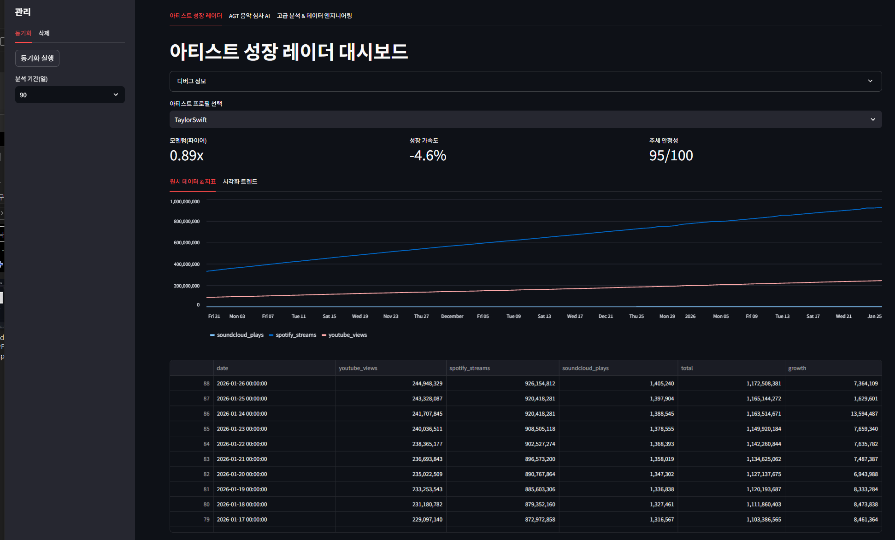
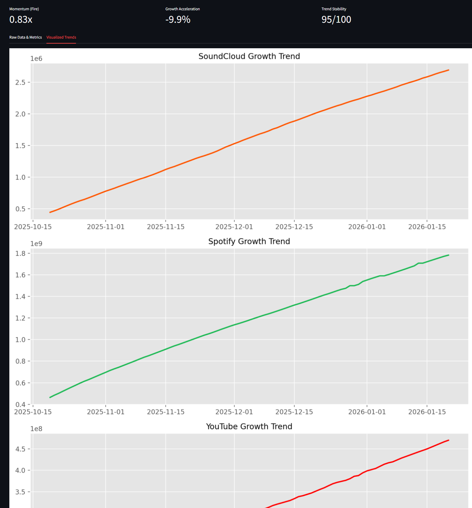
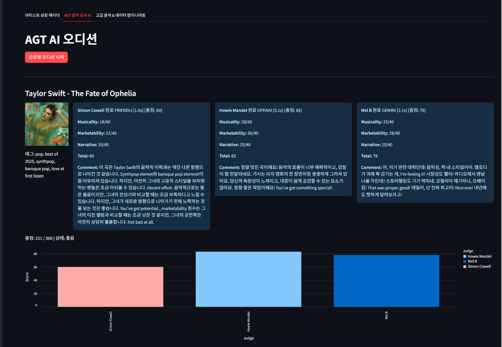
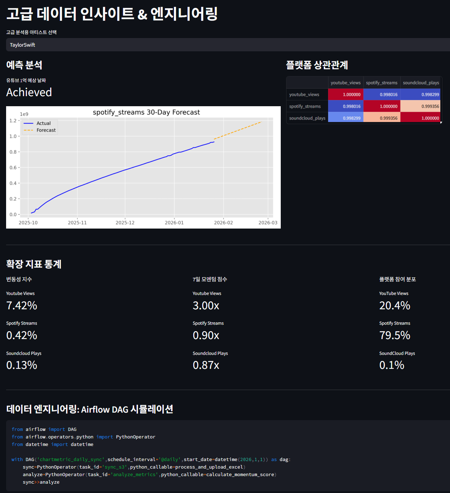

# 음악 통합 시스템 (Music Integrated System)

아티스트 분석 · AI 음악 심사 · 데이터 엔지니어링 플레이그라운드

[](#)
[](#)
[](#)

---

## 목차 (Table of Contents)

- [데모](#데모)
- [개요](#개요)
- [스크린샷](#스크린샷)
- [핵심 기능](#핵심-기능)
- [기술 스택](#기술-스택)
- [아키텍처](#아키텍처)
- [설치](#설치)
- [사용 방법](#사용-방법)
- [배포](#배포)

---

## 데모

**라이브 애플리케이션**: http://4.230.16.126:8504

---

## 개요

Music Integrated System은  
**아티스트 성장 분석**, **AI 기반 음악 평가**, **실전형 데이터 엔지니어링 구조**를 하나로 결합한 데이터 중심 분석 플랫폼입니다.

**세 가지 핵심 질문**
- 아티스트는 여러 플랫폼에서 어떻게 성장하고 있는가?
- 여러 AI 심사위원은 하나의 곡을 어떻게 평가하는가?
- 이 모든 과정을 실제 분석 파이프라인처럼 어떻게 구조화할 수 있는가?

---

## 스크린샷

### 1) 메인 인터페이스


### 2) 분석 결과


### 3) AGT 오디션


### 4) 고급 데이터 인사이트 & 엔지니어링


---

## 핵심 기능

### 아티스트 성장 레이더
- YouTube, Spotify, SoundCloud CSV 기반 지표 수집
- 플랫폼별 성장 추적 및 시각화
- 모멘텀, 변동성, 추세 안정성 분석

### AGT 음악 심사 AI
- 다중 LLM 스트리밍 평가(OpenAI, Gemini, Friendli)
- 심사위원별 개성 있는 페르소나 및 구조화된 점수 체계
- 종합 판정: HIT / GOOD / SOLID / BAD

### 고급 분석
- 마일스톤 기반 예측 분석
- 통계 지표(변동성, 모멘텀, 상관관계)
- 30일 미래 추정 시나리오

---

## 기술 스택

### 백엔드
- **Python 3.12** – 핵심 언어
- **Streamlit** – 대시보드 프레임워크
- **SQLAlchemy** – 데이터베이스 ORM
- **PostgreSQL** – 메인 데이터베이스
- **Scikit-learn** – 선형 회귀 기반 예측

### AI / ML
- **OpenAI GPT-4** – 심사 및 평가
- **Google Gemini** – 스트리밍 기반 AI 평가
- **Friendli AI** – Llama 계열 모델 평가

### 외부 서비스
- **AWS S3** – 가사 저장소
- **Last.fm API** – 음악 메타데이터 보강

---

## 아키텍처
```
[ CSV 파일 ]        [ S3 가사 ]
|                    |
v                    v
+-------------+     +-------------+
| 수집 파이프라인 |     | AGT 심사 AI |
| (Ingestion) |     | (스트리밍)   |
+------+------+     +------+------+
|                  |
v                  v
PostgreSQL         LLM 제공자
|
v
+--------------------------------+
| Streamlit 분석 대시보드          |
+--------------------------------+
```

**MVC 구조**
```
app.py              # UI 레이어
services.py         # 비즈니스 로직
analytics.py        # 분석 및 예측
data_processing.py  # CSV 수집 & S3
db.py               # 데이터베이스 처리
config.py           # 설정
```

---

## 설치

### 사전 요구 사항
- Python 3.11+
- PostgreSQL 15+

### 환경 변수 설정

`.env` 파일 생성:
```env
OPENAI_API_KEY=your-key
GOOGLE_API_KEY=your-key
FRIENDLI_API_KEY=your-key
LASTFM_API_KEY=your-key

AWS_ACCESS_KEY=your-key
AWS_SECRET_KEY=your-key
AWS_REGION=ap-northeast-1

PG_HOST=localhost
PG_PORT=5432
PG_DB=music
PG_USER=postgres
PG_PASSWORD=your-password
```

### 로컬 실행
```bash
cd backend
pip install -r requirements.txt
python -c "from db import init_db; init_db()"
streamlit run app.py --server.port 8501
```

---

## 사용 방법

### CSV 파일 네이밍 규칙

**형식:** `Artist_Song_Platform_Metric.csv`

**예시**
```
BTS_Dynamite_YouTube_views.csv
Adele_Hello_Spotify_streams.csv
MorganWallen_IBetterGet_SoundCloud_plays.csv
```

### 데이터 동기화 절차

1. CSV 파일을 `/cmdata` 디렉터리에 배치
2. 사이드바에서 **동기화 실행(Run Sync Process)** 클릭
3. 시스템이 CSV를 파싱·정규화하여 PostgreSQL에 저장
4. 대시보드가 최신 데이터로 갱신

### 품질 기준

전역 임계값: `value > 100,000`

저볼륨 데이터로 인한 노이즈를 줄이기 위해 차트 및 예측은 해당 기준 미만 데이터는 제외합니다.

---

## 배포

### 프로덕션(systemd)
```bash
sudo nano /etc/systemd/system/streamlit.service
```
```ini
[Unit]
Description=Streamlit 음악 분석 서비스
After=network.target

[Service]
User=azureuser
WorkingDirectory=/home/azureuser/project1/backend
Environment="OPENAI_API_KEY=..."
Environment="PG_HOST=localhost"
Environment="PG_USER=postgres"
Environment="PG_PASSWORD=..."
Environment="PG_DB=music"
ExecStart=/home/azureuser/.local/bin/streamlit run app.py --server.port 8501 --server.address 0.0.0.0
Restart=always

[Install]
WantedBy=multi-user.target
```
```bash
sudo systemctl daemon-reload
sudo systemctl start streamlit
sudo systemctl enable streamlit
```

**운영 환경**

* 서버: Azure VM (Ubuntu 24.04)
* 데이터베이스: PostgreSQL 15 (5432 포트, 외부 비공개)
* 애플리케이션: Streamlit (8501 포트, HTTP)

---

## 데이터베이스 스키마

| 테이블 | 목적 |
|--------|------|
| `artists` | 아티스트 마스터 데이터 |
| `daily_metrics` | 일별 플랫폼 지표(YouTube, Spotify, SoundCloud) |
| `artist_growth_data` | 파생 분석 지표 |

설계 원칙: Append-only 구조, `ON CONFLICT DO UPDATE`로 멱등성 보장

---

## 프로젝트 구조
```
ICT-Project2-KOR/
├── .streamlit/
│   └── secrets.toml
├── .venv/
├── backend/
│   ├── app.py                  # Streamlit 메인 UI
│   ├── services.py             # AI 심사 패널 & API 클라이언트
│   ├── analytics.py            # 통계 및 예측
│   ├── data_processing.py      # CSV 수집 & S3 연동
│   ├── config.py               # 설정
│   ├── db.py                   # DB 처리
│   ├── requirements.txt        # 의존성
│   └── cmdata/                 # CSV 데이터 디렉터리
├── frontend/
├── screenshots/                # 스크린샷 저장소
│   ├── main-interface.png
│   ├── analysis-results.png
│   ├── AGT-Audition.png
│   └── Advanced-Data-Insights&Engineering.png
└── streamlit_5174.log
```

---

## AI 심사 시스템

### 평가 흐름

1. S3에서 가사 미리보기 로드
2. Last.fm API로 메타데이터 보강
3. 3명의 심사위원에게 동시에 프롬프트 전송
4. 토큰 단위 실시간 스트리밍
5. 점수 및 피드백 파싱
6. 최종 판정 집계

### 심사위원 페르소나

| 제공자 | 모델 | 심사위원 | 스타일 |
|--------|------|---------|--------|
| Friendli | meta-llama-3.1-8b | Simon Cowell | 영국식 독설 |
| OpenAI | gpt-4o-mini | Howie Mandel | 미국식 열정 |
| Google Gemini | gemini-2.0-flash-lite | Mel B | 강렬한 스파이스 걸 |

**판정 기준**

* HIT (255+/300)
* GOOD (200–254)
* SOLID (160–199)
* BAD (<160)

---

## 라이선스

MIT License

---

## 감사의 말

* Streamlit – 빠른 대시보드 프로토타이핑
* OpenAI, Google, Friendli – LLM 인프라
* Last.fm – 음악 메타데이터 API